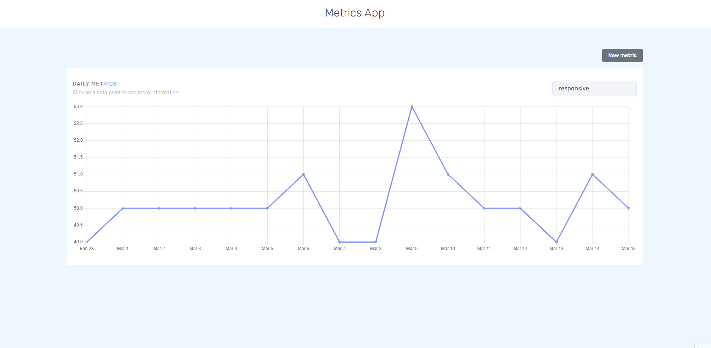
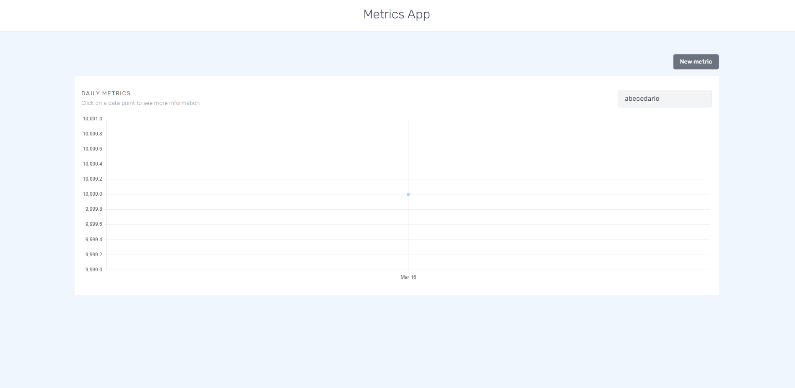

# Metrics

Fullstack application to visualize and create metrics

## Features

### Create new metrics

- Create metrics given a name and value.
- Validate if the metric name and input.



### Metrics Visualization

#### Filter

- Select the metric you want to visualize.
- The first metric returned is selected by default.



#### Drill Down

- Metrics average are grouped per day by default
- When clicking a specific dataset point on the day vizualization it will go to the hour vizualization
- When clicking a specific dataset point on the hour vizualization it will go to the minute vizualization


## Setup

### Necessary Tools

- yarn v1
- docker
- node v14

### Steps

1. Clone the project
   `https://github.com/larizzatg/metrics.git`
2. Enter the directory `cd metrics`
3. Execute `yarn install`
4. Go to the api directory `cd metrics/apps/api`
5. Create a .env files
   - copy the values of example.env
   - add password
   - modify as you like
6. In the api dir open run `docker-compose up -d` this will run the docker image with the database on detachment mode
7. Move back to the parent directoy `cd ../../` and run `yarn dev`

- client port default is `localhost:3000`
- api port default is `localhost:4000`

#### Seed the database (Optional)

- Conect with your favorite db manager and run this query to seed the db, modify it as you like

```sql
INSERT INTO
  metric
SELECT
  id,
  name,
  value,
  -- modify generated interval with random minutes
  TIMESTAMP + random() * (
    timestamp '2017-12-31 00:00:30' - timestamp '2017-12-31 00:00:59'
  ) TIMESTAMP
FROM
  (
    SELECT
      row_number() OVER () AS id,
      -- the name of the metric
      'responsive' as name,
      -- random value for the metric
      ROUND(random() * 100) as value,
      *
    FROM
    -- generate data from 03-01 until
    -- current date with one minute intervals
      generate_series(
        '2022-03-01 00:00:00.00+00',
        NOW(),
        INTERVAL '1 minute'
      ) as TIMESTAMP
  ) query_generator;

-- alter the sequence so it's nice with the orm
ALTER SEQUENCE metric_id_seq RESTART WITH  100000;

```

## Stack

Turbo repo and yarn workspaces for monorepo managament

### Frontend

- vite for bundling and dev server
- typescript
- vue3 as a web framework
- storybook for rapid testing of components
- tailwind as a css utility framework
- chart.js to display the visualizations
- vitest as a test runner
- testing/library for component testing
- cypress for e2e (not in use)
- msw to mock server calls
- prettier for code formating
- axios for api call
- date-fns, date-fns-tz as a time scale adapter for chart.js and some time utility functions
- headless/ui for select and modal headless logic
- vue-toastification to display status messages

### Backend

- nestjs as a backend framework with express.js and typeorm
- postgress as a database
- typescript
- jest for testing
- prettier
- class-validator/transformer for dto pipe validation
- hapi/joi for configuration schema

## Considerations and Roadmap

- move shared types to it's own package inside the yarn workspace

#### Frontend

- make timeline-chart an async component for better bundler
- need to decouple logic from metric-selector so we can refresh the data
- add stories for all component
- add unit testing for metric form state
- add component testing for core components like the form and the timeline
- add e2e testing and fixx msw calls

#### Backend

- install a seeder so we have e2e tests with specific data
